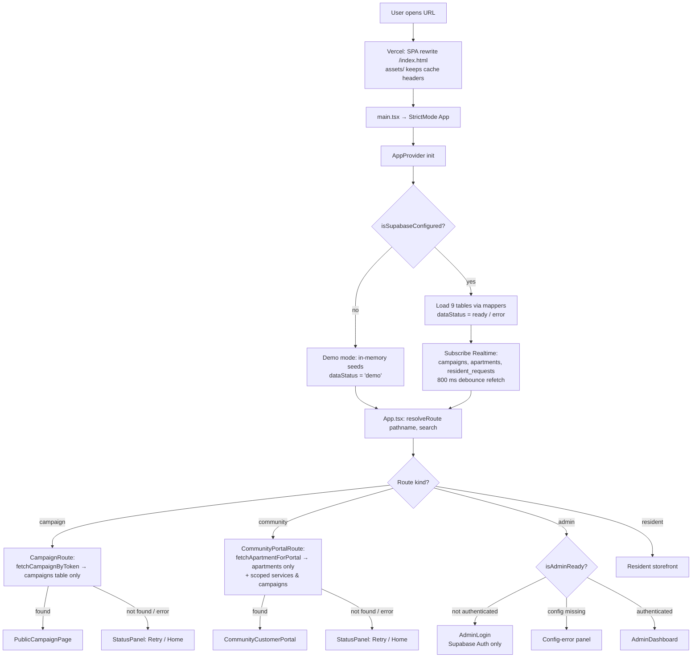
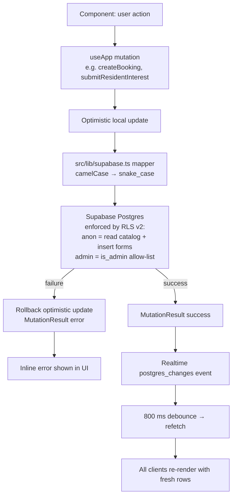
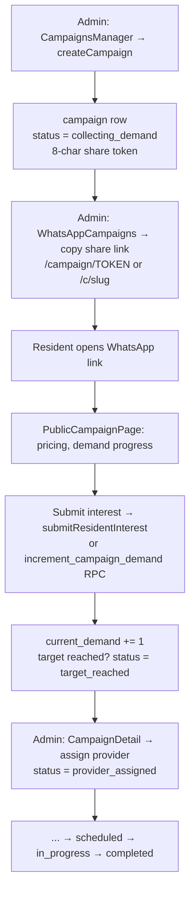
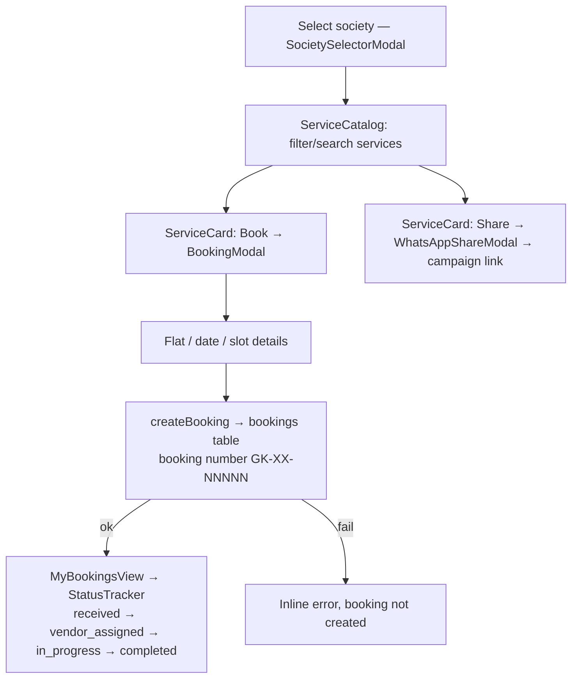
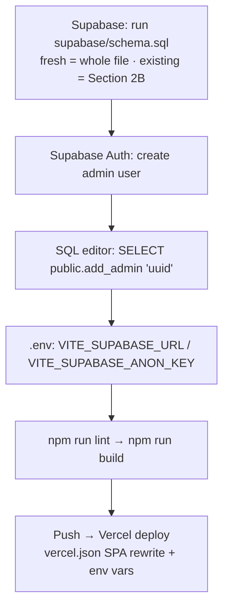

# GK Apartment Care — Application Workflow

Flowcharts of how the app runs at runtime, how data moves, and the key business flows.
(Mermaid blocks render on GitHub; ASCII versions are readable anywhere.)

---

## 1. Boot & Route Resolution (every page load)



ASCII:

```
                     ┌──────────────────────────┐
                     │     User opens a URL     │
                     └────────────┬─────────────┘
                                  ▼
        Vercel rewrite "/((?!assets/).*)" → /index.html   (assets keep cache headers)
                                  ▼
                     main.tsx → <AppProvider> → App.tsx
                                  ▼
                   AppContext: isSupabaseConfigured() ?
                       │ yes                    │ no
                       ▼                        ▼
        Load 9 tables + Realtime sub     Demo mode — in-memory seeds
        (campaigns/apartments/requests,  only; dataStatus = 'demo'
         800 ms debounce)                (admin routes blocked)
                       └───────────┬───────────┘
                                   ▼
        resolveRoute(pathname, search)   ← src/lib/router.ts (pure, deterministic)
                                   ▼
   ┌───────────────┬───────────────┼───────────────────┐
   ▼               ▼               ▼                   ▼
campaign        community        /admin*           resident (default)
   │               │               │                   │
   ▼               ▼               ▼                   ▼
fetchCampaign   fetchApartment   isAdminReady?      Navbar + tab views
ByToken()       ForPortal()      │no → AdminLogin   services / community /
(campaigns      (apartments      │yes→ AdminDashboard  my-bookings / rwa / vendor
 table only)     only + scoped   (+ is_admin() RLS)  + global modals:
   │             services &                          BookingModal,
   ▼             campaigns)                          WhatsAppShareModal,
found? ─ yes →                                       SocietySelectorModal
PublicCampaignPage
   │ no                     not found / error on any route
   ▼                                  ▼
StatusPanel (Retry / Home)  ← shared fallback UI
```

---

## 2. Data & Mutation Flow (every write)



ASCII:

```
component action
   │  useApp() mutation (awaitable)
   ▼
optimistic local update ──► src/lib/supabase.ts mapper ──► Supabase Postgres
                                                            │ RLS v2:
                                                            │  anon  → read catalog,
                                                            │           INSERT forms
                                                            │  admin → is_admin() allow-list
                        ┌────────────── success ────────────┤
                        ▼                                   ▼ failure
             MutationResult.success                rollback optimistic update
                        │                                   ▼
                        ▼                          inline error in UI
        Realtime postgres_changes event
                        ▼
             800 ms debounce → refetch rows
                        ▼
        every connected client re-renders
```

---

## 3. Campaign (Group-Buy) Lifecycle



ASCII:

```
Admin creates campaign (collecting_demand, 8-char token)
        │
        ▼
Admin copies WhatsApp share link  /campaign/TOKEN
        │
        ▼
Residents open link → PublicCampaignPage
        │  submit interest (anon INSERT → resident_requests,
        │  demand via increment_campaign_demand RPC)
        ▼
current_demand++ ──≥ minimum_demand → status = target_reached
        │
        ▼
Admin assigns provider → provider_assigned → scheduled
        │
        ▼
in_progress → completed        (realtime keeps every screen in sync)
```

---

## 4. Resident Booking Flow



ASCII:

```
Pick society → browse ServiceCatalog → Book on ServiceCard
      → BookingModal (flat, date, slot)
      → createBooking → bookings (GK-XX-NNNNN)
      → MyBookingsView → StatusTracker timeline
Alternate: Share → WhatsAppShareModal → campaign link out
```

---

## 5. Setup & Deploy Flow (one-time / per release)



ASCII:

```
Run supabase/schema.sql (fresh: whole file / existing: Section 2B migration)
   → create admin user in Supabase Auth
   → SELECT public.add_admin('<auth-user-uuid>')
   → set VITE_SUPABASE_URL + VITE_SUPABASE_ANON_KEY (local .env + Vercel)
   → npm run lint && npm run build
   → push → Vercel (SPA rewrite keeps /c/... and /campaign/... alive)
```
