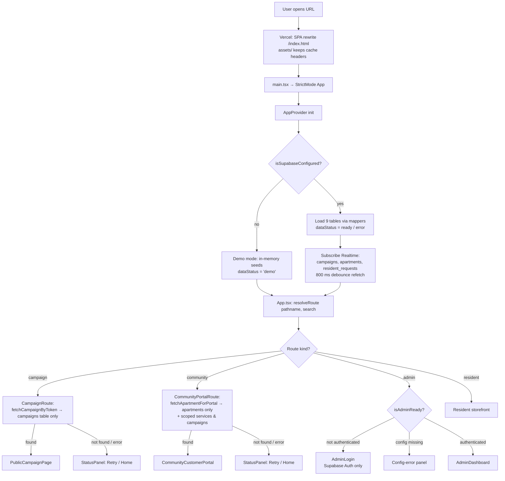
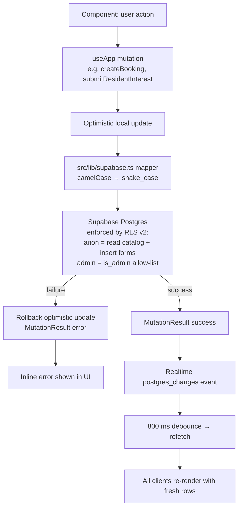
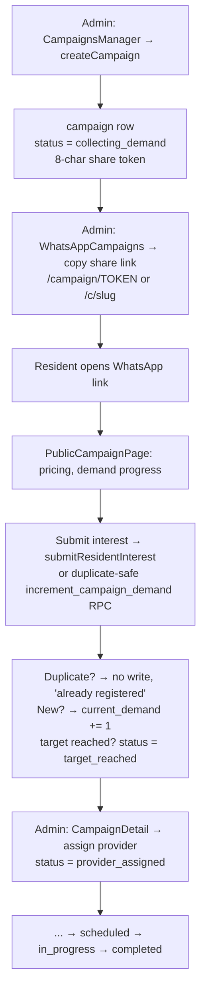
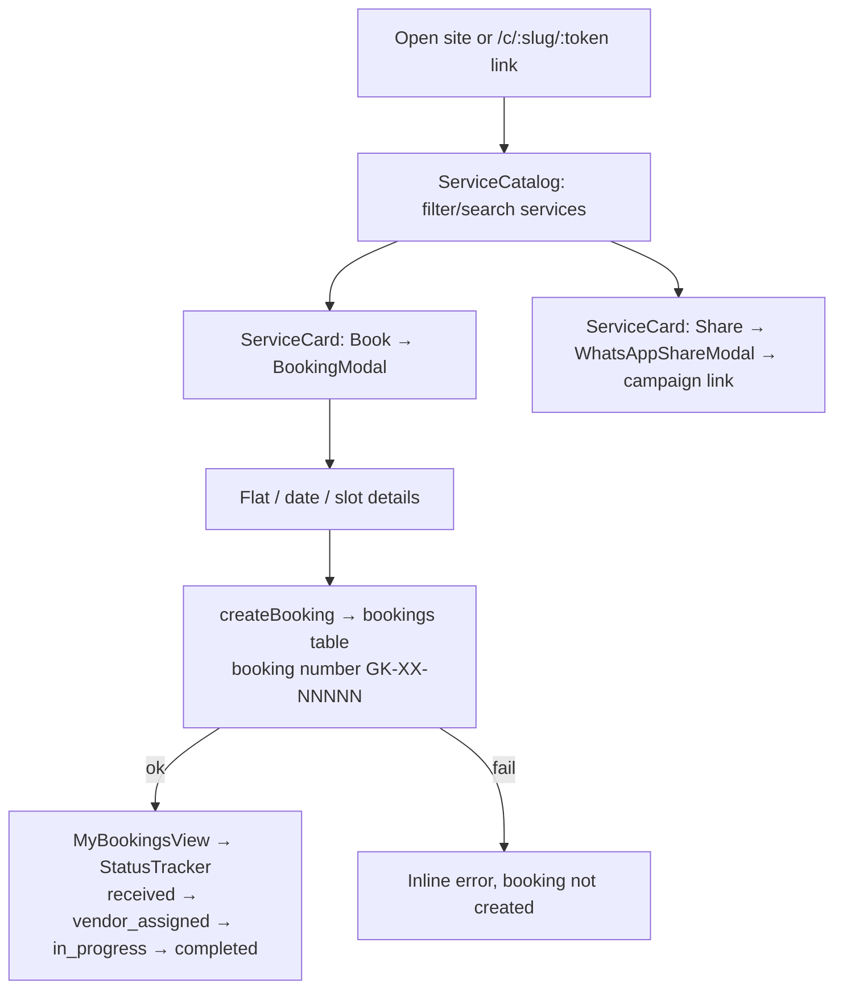
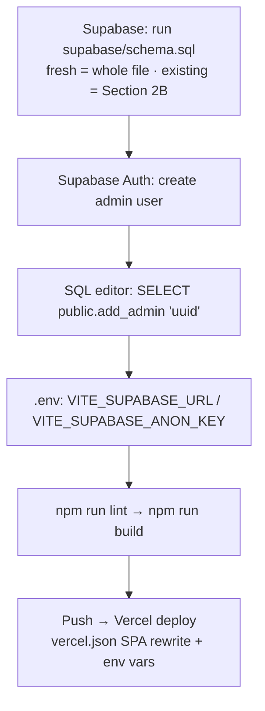

# GK Apartment Care — Complete Project Documentation Bundle

Generated on: 2026-09-29T18:15:50.571Z

This bundle compiles all architectural, domain, component, and database documentation across the GK Apartment Care codebase.

---

## Table of Contents

1. [Root Project Overview](#00_root_readme)
2. [Platform Architecture & Workflows](#01_workflow)
3. [Source Directory Guide](#02_src_readme)
4. [React UI Components Overview](#03_components_readme)
5. [Design System Primitives (Button, Badge, Marquee, etc.)](#04_components_ui_readme)
6. [Global Chrome (Navbar, PromoBar, Footer, Logo)](#05_components_common_readme)
7. [Resident Storefront & Homepage Sections](#06_components_resident_readme)
8. [Public Community Portals & WhatsApp Links](#07_components_public_readme)
9. [Admin Operations Dashboard & Resource Managers](#08_components_admin_readme)
10. [Global State Store (AppContext)](#09_context_readme)
11. [Demo Seed Data](#10_data_readme)
12. [Utilities, Router & Supabase Client](#11_lib_readme)
13. [Domain Types & Interfaces](#12_types_readme)
14. [Supabase Database Schema & RLS Policies](#13_supabase_readme)

---


# 00_ROOT_README.md
### Root Project Overview
*Original path: `README.md`*

# GK Apartment Care — Hyper-Local Community Services

Community-first home & auto care platform for gated communities in Hyderabad. Residents access verified doorstep services at exclusive community bulk prices, join **Sunday bulk demand pools** through group-buying campaigns, track live order status with gate-pass clearance, and share WhatsApp campaign links. Operators manage communities, campaigns, service providers, and bookings from an integrated admin operations dashboard.

## Tech Stack

| Layer      | Technology |
|------------|------------|
| UI         | React 19, TypeScript, Tailwind CSS 4 (via `@import "tailwindcss"` in `src/index.css`), Motion (`motion/react`), lucide-react icons |
| Design     | Editorial design system: warm neutral token palette (`--bg: #FAF8F5`, `--surface: #FFFFFF`, `--surface-alt: #F0EDE7`, `--ink: #111111`, `--line: #E4E0D8`, `--accent: #2596be`), tight-tracked display typography, 24px card radius, hairline borders, and full-pill action buttons |
| Build      | Vite 8 (`vite.config.ts`), deployed on Vercel (`vercel.json` SPA rewrites) |
| Backend    | Supabase (Postgres + Auth + Realtime) — `@supabase/supabase-js` |
| State      | Single React Context (`src/context/AppContext.tsx`); **Supabase is the single source of truth** (demo mode keeps in-memory seeds only — no localStorage persistence of app data) |

## Getting Started

```bash
npm install
npm run dev      # dev server on port 3000
npm run build    # production build to dist/
npm run lint     # TypeScript check (tsc --noEmit)
```

Copy `.env.example` to `.env` and set `VITE_SUPABASE_URL` / `VITE_SUPABASE_ANON_KEY`.

- **With env vars set** — the app loads live data from Supabase and every mutation writes to Postgres, guarded by secure RLS policies in `supabase/schema.sql`.
- **Without env vars** — the app runs in a local demo mode backed by in-memory collections; admin dashboard and login require Supabase.

The first-run backend checklist lives in `supabase/README.md`: apply `supabase/schema.sql`, then promote your operator account with `SELECT public.add_admin('<auth-user-uuid>');`.

## Folder Map

```
├── index.html               Vite entry HTML (loads Google fonts & /src/main.tsx)
├── vite.config.ts           Build config, @/ path alias, HMR flags
├── vercel.json              Vercel deployment: SPA rewrite "/(.*)" → /index.html
├── supabase-schema.sql      Copy of the DB schema
├── src/                     Application source → see src/README.md
│   ├── components/          All React UI components → see src/components/README.md
│   │   ├── admin/           Operator dashboard (12 resource managers) → admin/README.md
│   │   ├── common/          Navbar / PromoBar / Footer / Logo → common/README.md
│   │   ├── public/          Anonymous link pages (scoped community portals) → public/README.md
│   │   ├── resident/        Resident storefront & section rhythm → resident/README.md
│   │   └── ui/              Reusable design system primitives (Button, Badge, Marquee, etc.) → ui/README.md
│   ├── context/             Global state store (AppContext) → context/README.md
│   ├── data/                In-memory demo seeds → data/README.md
│   ├── lib/                 Router, ID/token generators, Supabase client → lib/README.md
│   └── types/               Shared TypeScript domain models → types/README.md
└── supabase/                SQL schema (secure RLS v2) → supabase/README.md
```

## How the Architecture Connects

```
              ┌─────────────────────────────────────────────────────────────┐
              │  src/main.tsx → src/App.tsx                                 │
              │  (entry; classifies URLs & composes views from router)      │
              └──┬──────────────────────────┬───────────────────────────────┘
                 │ resolveRoute()           │ wraps tree in AppProvider
                 ▼                          ▼
        ┌────────────────┐        ┌──────────────────────────────┐
        │ src/lib/router │        │     src/context/AppContext   │
        └────────────────┘        │ (single source of truth for  │
                                  │  app data, auth, & modals)   │
                                  └──┬──────────┬──────────┬─────┘
                          reads/writes│          │ maps rows│ seeds (demo mode)
                                      ▼          ▼          ▼
                     src/lib/supabase.ts  src/types/index.ts  src/data/mockData.ts
                                      ▲
                                      │  SQL mirrors domain entities
                            supabase/schema.sql
```

* **`src/lib/router.ts`** is the URL router: a pure `resolveRoute(pathname, search)` classifying every URL as `campaign` / `community` / `admin` / `resident` (plus `isAdminPath`).
* **`src/App.tsx`** handles top-level view composition:
  - **Public Campaign Links (`/campaign/:token`, `/book/:token`, `?token=`)** → `public/PublicCampaignPage`
  - **Resident Community Portals (`/c/:slug/:token`, `/c/:slug`)** → `public/CommunityCustomerPortal` (scoped queries; includes tabbed **Services & Bulk Pools** and **Track Orders & Bookings** timeline)
  - **Admin Operations Portal (`/admin*`)** → `admin/AdminLogin` or `admin/AdminDashboard`
  - **Public Homepage (`/`)** → Composed of `PromoBar`, `Navbar`, the complete resident section rhythm (`Hero`, `StepsSection`, `ServicesMarquee`, `ServiceCatalog`, `ComparisonSection`, `NetworkSection`, `AssociationTrustSection`, `FAQSection`, `ClosingCTA`), and `Footer`.
* **`src/components/ui/`** contains reusable design tokens and primitive components:
  - `Button`: Pill button supporting `primary`, `secondary`, `inverse`, `accent`, and `link` variants.
  - `Badge`: Pill badge labels for status indicators and society metadata.
  - `Section`: Container enforcing 1280px max-width, responsive gutters, and alternating surface backgrounds.
  - `Marquee`: Continuous looping marquee with pause-on-hover, accessible controls, and `prefers-reduced-motion`.
  - `StatCard`: Large numeral display cards.
  - `Accordion`: Single-open FAQ accordion with rotating indicators and hairline dividers.
* **`src/context/AppContext.tsx`** is the central state store: owns the 9 data collections, optimistic awaitable `MutationResult` methods, admin session state, and debounced Supabase Realtime subscriptions.
* **`src/lib/supabase.ts`** encapsulates Supabase SDK client initialization, environment validation (`isSupabaseConfigured`), and camelCase↔snake_case row mappers.

## Resident Community Portal (`/c/:slug/:token`)

The resident service portal serves individual gated communities:
1. **Services & Bulk Pools Tab:** Displays live community campaigns, standard vs. doorstep bulk rates, minimum demand thresholds, and one-click "Join Community Bulk Pool" interest registration.
2. **Track Orders & Bookings Tab:** Allows residents to filter by flat number, name, phone, or booking number, and view live status badges alongside a 4-step progress timeline (`Received` → `Vendor Assigned` → `In Progress` → `Completed`), gate pass verification with society security apps (e.g. MyGate), and direct WhatsApp support links.

## Deployment Notes (Vercel)

- `vercel.json` uses the standard Vercel SPA rewrite (`"source": "/(.*)"` → `/index.html`), ensuring deep links (`/c/:slug/:token`, `/campaign/:token`, `/admin`) resolve smoothly on direct navigation and refresh.
- The build outputs `dist/vercel.json` automatically via the Vite config plugin.
- Communities are database-driven: any `/c/:communitySlug/:token` resolves at runtime against the `apartments` table in Supabase.


---


# 01_WORKFLOW.md
### Platform Architecture & Workflows
*Original path: `WORKFLOW.md`*

# GK Apartment Care — Application Workflow

Flowcharts of how the app runs at runtime, how data moves, and the key business flows.
(Mermaid blocks render on GitHub; ASCII versions are readable anywhere.)

---

## 1. Boot & Route Resolution (every page load)



ASCII:

```
                     ┌──────────────────────────┐
                     │     User opens a URL     │
                     └────────────┬─────────────┘
                                  ▼
        Vercel rewrite "/(.*)" → /index.html              (assets keep cache headers)
                                  ▼
                     main.tsx → <AppProvider> → App.tsx
                                  ▼
                   AppContext: isSupabaseConfigured() ?
                       │ yes                    │ no
                       ▼                        ▼
        Load 9 tables + Realtime sub     Demo mode — in-memory seeds
        (campaigns/apartments/requests,  only; dataStatus = 'demo'
         800 ms debounce)                (admin routes blocked)
                       └───────────┬───────────┘
                                   ▼
        resolveRoute(pathname, search)   ← src/lib/router.ts (pure, deterministic)
                                   ▼
   ┌───────────────┬───────────────┼───────────────────┐
   ▼               ▼               ▼                   ▼
campaign        community        /admin*           resident (default)
   │               │               │                   │
   ▼               ▼               ▼                   ▼
fetchCampaign   fetchApartment   isAdminReady?      Navbar + tab views
ByToken()       ForPortal()      │no → AdminLogin   services / my-bookings /
(campaigns      (apartments      │yes→ AdminDashboard  my-bookings / rwa / vendor
 table only)     only + scoped   (+ is_admin() RLS)  + global modals:
   │             services &                          BookingModal,
   ▼             campaigns)                          WhatsAppShareModal,
found? ─ yes →
PublicCampaignPage
   │ no                     not found / error on any route
   ▼                                  ▼
StatusPanel (Retry / Home)  ← shared fallback UI
```

---

## 2. Data & Mutation Flow (every write)



ASCII:

```
component action
   │  useApp() mutation (awaitable)
   ▼
optimistic local update ──► src/lib/supabase.ts mapper ──► Supabase Postgres
                                                            │ RLS v2:
                                                            │  anon  → read catalog,
                                                            │           INSERT forms
                                                            │  admin → is_admin() allow-list
                        ┌────────────── success ────────────┤
                        ▼                                   ▼ failure
             MutationResult.success                rollback optimistic update
                        │                                   ▼
                        ▼                          inline error in UI
        Realtime postgres_changes event
                        ▼
             800 ms debounce → refetch rows
                        ▼
        every connected client re-renders
```

---

## 3. Campaign (Group-Buy) Lifecycle



ASCII:

```
Admin creates campaign (collecting_demand, 8-char token)
        │
        ▼
Admin copies WhatsApp share link  /campaign/TOKEN
        │
        ▼
Residents open link → PublicCampaignPage
        │  submit interest (anon INSERT → resident_requests,
        │  demand via increment_campaign_demand RPC)
        ▼
current_demand++ ──≥ minimum_demand → status = target_reached
        │
        ▼
Admin assigns provider → provider_assigned → scheduled
        │
        ▼
in_progress → completed        (realtime keeps every screen in sync)
```

---

## 4. Resident Booking Flow



ASCII:

```
Pick society → browse ServiceCatalog → Book on ServiceCard
      → BookingModal (flat, date, slot)
      → createBooking → bookings (GK-XX-NNNNN)
      → MyBookingsView → StatusTracker timeline
Alternate: Share → WhatsAppShareModal → campaign link out
```

---

## 5. Setup & Deploy Flow (one-time / per release)



ASCII:

```
Run supabase/schema.sql (fresh: whole file / existing: Section 2B migration)
   → create admin user in Supabase Auth
   → SELECT public.add_admin('<auth-user-uuid>')
   → set VITE_SUPABASE_URL + VITE_SUPABASE_ANON_KEY (local .env + Vercel)
   → npm run lint && npm run build
   → push → Vercel (SPA rewrite keeps /c/... and /campaign/... alive)
```


---


# 02_SRC_README.md
### Source Directory Guide
*Original path: `src/README.md`*

# `src/` — Application Source

Entry chain: `index.html` → `main.tsx` → `App.tsx`.

| Folder / File | Purpose |
|---------------|---------|
| `main.tsx` | React 19 `createRoot` bootstrap, mounts `<App />` in `StrictMode`, imports `index.css` (Tailwind). |
| `App.tsx` | Root component: wraps the tree in `AppProvider`, resolves the URL with `src/lib/router.ts`, and renders exactly one top-level view. Campaign and community-portal routes fetch their own scoped rows from Supabase and share `StatusPanel` (loading / error / retry) fallbacks. |
| `index.css` | Global stylesheet; imports Tailwind CSS 4 (`@import "tailwindcss"`). |
| `components/` | All React UI, split by audience. → `components/README.md` |
| `context/` | `AppContext.tsx` — the single global state store. → `context/README.md` |
| `data/` | In-memory demo seeds (used only when Supabase is not configured). → `data/README.md` |
| `lib/` | URL router, ID/token generators, Supabase client + DB row mappers. → `lib/README.md` |
| `types/` | Shared TypeScript domain models. → `types/README.md` |

## Routing (App.tsx + src/lib/router.ts)

`App.tsx` keeps a lightweight `window.location` + `history.pushState`/`popstate` router
(exposed through the context as `currentPath` / `navigate`), but the **route classification
lives in `src/lib/router.ts`** as the pure function `resolveRoute(pathname, search)`.
Resolution priority:

1. **Campaign deep links** — `?token=` / `?campaign=`, `/campaign/:token`, `/book/:token`,
   `/community/:slug/:service/:token` → `CampaignRoute` renders `public/PublicCampaignPage`
   after `fetchCampaignByToken(token)` (campaigns table only) succeeds.
2. **Community portal links** — `?c=` / `?community=`, `/c/:slug/:token`, `/c/:slug`,
   `/community-portal/:idOrSlug` → `CommunityPortalRoute` renders
   `public/CommunityCustomerPortal` from `fetchApartmentForPortal(...)` plus that
   community's campaigns and services (scoped queries — no full-table loads).
3. **Admin namespace** — `/admin*` (or `?admin=true`) → `admin/AdminLogin` until
   `isAdminReady` becomes true via Supabase Auth, then `admin/AdminDashboard`. Blocked with
   a config-error panel when Supabase env vars are missing/placeholder.
4. **Generic root website (`/`)** — `/` always renders the general GK Apartment Care
   storefront (Navbar, Hero, ServiceCatalog, TrustSection, Footer). No community
   selection, no modal gate, no redirect, no auto-selected community; community entry
   happens only via explicit /c/:slug/:token portal links.
5. **Default resident experience** — `common/Navbar` + one of the `resident` tab views
   (`services`, `my-bookings`, `rwa`, `vendor`) + `common/Footer`, with the
   global modals `BookingModal` and `WhatsAppShareModal` mounted.

Campaign and portal routes render a shared `StatusPanel` for loading, error (with Retry +
Home actions), and "not found" states, and show a banner when running in demo mode or when
Supabase config is broken. It also syncs the URL-selected community back into context state
(`selectedApartmentId`) and honors a legacy `?service=` deep link by opening the booking modal.

## Folder Connections

- `App.tsx` imports `lib/router.ts` (route classification) and from **every** component
  folder plus `context/AppContext`.
- Everything under `components/` consumes state and mutations from `context/` via `useApp()`.
- `context/` imports types from `types/`, seeds from `data/` (demo mode only), and the
  Supabase client/mappers from `lib/` — the only folder that talks to the backend SDK.
- `supabase/schema.sql` (outside `src/`) mirrors `types/` one SQL table per TS interface and
  defines the RLS model every query must respect.


---


# 03_COMPONENTS_README.md
### React UI Components Overview
*Original path: `src/components/README.md`*

# `src/components/` — React UI Layer

All presentational and interactive components, organized by domain and audience. Data and mutations are consumed from **`src/context/AppContext.tsx`** via the `useApp()` hook.

## Sub-folders

| Folder | Audience | Contents |
|--------|----------|----------|
| `ui/` | Reusable Primitives | Foundation tokens & design system primitives: `Button`, `Badge`, `Section`, `Marquee`, `StatCard`, `Accordion`. → `ui/README.md` |
| `common/` | Global Chrome | Shared layout components: `Navbar`, `PromoBar`, `Footer`, `Logo`. → `common/README.md` |
| `resident/` | Public Website & Residents | Homepage sections (`Hero`, `StepsSection`, `ServicesMarquee`, `ServiceCatalog`, `ComparisonSection`, `NetworkSection`, `AssociationTrustSection`, `FAQSection`, `ClosingCTA`), RWA partnership proposals, vendor partner onboarding, and global modals (`BookingModal`, `WhatsAppShareModal`). → `resident/README.md` |
| `public/` | Gated Community Link Visitors | Scoped customer portals: `CommunityCustomerPortal` (tabbed **Services & Bulk Pools** + **Track Orders & Bookings**) and `PublicCampaignPage` (WhatsApp campaign group-buying links). → `public/README.md` |
| `admin/` | Platform Operators | Admin operations hub: Supabase authentication, dashboard overview, and 12 dedicated resource managers. → `admin/README.md` |

## Connections

- **Rendered by** `src/App.tsx`, which classifies the URL via `src/lib/router.ts`.
- **Styling:** Tailwind CSS 4 with CSS variables defined in `src/index.css`.
- **Icons & Motion:** `lucide-react` for stroke icons and `motion/react` for layout and reveal animations.


---


# 04_COMPONENTS_UI_README.md
### Design System Primitives (Button, Badge, Marquee, etc.)
*Original path: `src/components/ui/README.md`*

# `src/components/ui/` — Design System Primitives

Reusable UI components implementing the visual language and token system (`DESIGN_SYSTEM.md`, `COMPONENTS.md`, `INTERACTIONS.md`):

| File | Component | Description & Token Usage |
|------|-----------|---------------------------|
| `Button.tsx` | `<Button />` | Full-pill buttons (`rounded-full`, h48/h56, px28) with `primary` (ink fill `#111111`), `secondary` (hairline border `#E4E0D8`), `inverse` (light fill `#FAF8F5` on dark), `accent` (`#2596be`), and `link` styles. |
| `Badge.tsx` | `<Badge />` | Full-pill labels (h28, px12) with `neutral`, `accent`, `success`, and `outline` variants for metadata and status indicators. |
| `Section.tsx` | `<Section />` | Standardized section container enforcing 1280px max-width, responsive vertical padding (64px mobile / 96px tablet / 128px desktop), and background tokens (`bg`, `surface`, `surface-alt`, `inverse`). |
| `Marquee.tsx` | `<Marquee />` | Infinite linear CSS transform marquees (left/right direction, speed presets) with pause-on-hover, accessible pause/play toggle, and `prefers-reduced-motion` compliance. |
| `StatCard.tsx` | `<StatCard />` | Large numeral anchor cards (`clamp(44px, 7vw, 88px)` display numbers) with labels, descriptions, and 24px card radii. |
| `Accordion.tsx` | `<Accordion />` | Smooth single-open accordion for FAQs with rotating indicators, hairline dividers, and accessible ARIA attributes. |

## Design Tokens (consumed via `src/index.css`)

- **Palette:** `--bg: #FAF8F5`, `--surface: #FFFFFF`, `--surface-alt: #F0EDE7`, `--ink: #111111`, `--ink-muted: #5C5A56`, `--line: #E4E0D8`, `--accent: #2596be`, `--inverse-bg: #111111`, `--inverse-ink: #FAF8F5`
- **Radii:** Pill (`9999px`), Card (`24px`), Small (`12px`)
- **Typography:** `Plus Jakarta Sans` / `Inter` / `JetBrains Mono`


---


# 05_COMPONENTS_COMMON_README.md
### Global Chrome (Navbar, PromoBar, Footer, Logo)
*Original path: `src/components/common/README.md`*

# `src/components/common/` — Global Chrome

Shared header, promo, footer, and branding components:

| File | Role |
|------|------|
| `PromoBar.tsx` | Top announcement bar highlighting Sunday bulk discount batches with inline exploration action. |
| `Navbar.tsx` | Sticky navigation with brand wordmark, tab triggers (Services, RWA Society Partners, Service Providers), helpline quick link, and primary "Book a Service" pill button. |
| `Footer.tsx` | 4-column structured footer with brand mission, platform links, Hyderabad operations desk, operator portal login link, and interactive legal policy modals (Privacy, Terms, Cancellation). |
| `Logo.tsx` | Parameterizable SVG apartment tower icon and brand typography. |


---


# 06_COMPONENTS_RESIDENT_README.md
### Resident Storefront & Homepage Sections
*Original path: `src/components/resident/README.md`*

# `src/components/resident/` — Resident Storefront & Homepage

The public web experience for Hyderabad residents: discovering doorstep home and auto services, exploring community bulk pricing, and submitting partnership applications.

## Files

| File | Role |
|------|------|
| `Hero.tsx` | Display headline, primary & secondary action CTAs, and a pinned live stat ticker marquee. |
| `StepsSection.tsx` | 01–03 numbered 3-step breakdown of hyper-local demand pooling and doorstep delivery. |
| `ServicesMarquee.tsx` | Dual-row continuous marquee of apartment service offerings with pause/play controls. |
| `ServiceCatalog.tsx` | Filterable service grid with search bar, category pill chips, and empty state fallback. |
| `ServiceCard.tsx` | 24px-radius service card with standard price vs. doorstep bulk price breakdown, booking modal trigger, and WhatsApp sharing. |
| `ComparisonSection.tsx` | Feature comparison table contrasting GK Apartment Care against random outside vendors. |
| `NetworkSection.tsx` | Hyderabad network stat cards (`25K+ Flats`, `45+ Societies`, `35% Savings`, `4.9★ Rating`) paired with an instant society/area lookup tool. |
| `AssociationTrustSection.tsx` | Verified society protocols (quiet hours, police verification, gate passes) and RWA committee testimonials. |
| `FAQSection.tsx` | Accordion FAQ addressing pooling mechanics, quiet hours, staff verification, and payment terms. |
| `ClosingCTA.tsx` | Full-bleed dark inverse section with dual pill buttons. |
| `RWAPartnershipsView.tsx` | "RWA Society Partners" tab: partnership proposal pitch + society onboarding application form. |
| `VendorOnboardingView.tsx` | "Service Providers" tab: partner benefits pitch + vendor application form. |
| `BookingModal.tsx` | Global multi-step booking modal: community selection, date/slot picker, resident details, and confirmation card. |
| `WhatsAppShareModal.tsx` | Global WhatsApp share modal: formatted society group message generator with copy/redirect actions. |
| `MyBookingsView.tsx` & `StatusTracker.tsx` | Booking lookup & visual progress timeline component. |

## Connections

- **Composed by** `src/App.tsx` on the default route (`/`) along with `PromoBar`, `Navbar`, and `Footer`.
- **Modals** (`BookingModal`, `WhatsAppShareModal`) are mounted globally at the root of `App.tsx` and driven by context state.


---


# 07_COMPONENTS_PUBLIC_README.md
### Public Community Portals & WhatsApp Links
*Original path: `src/components/public/README.md`*

# `src/components/public/` — Scoped Community Portals & Campaign Links

Dedicated pages for residents arriving via society portal links (`/c/:slug/:token`) or WhatsApp campaign deep links (`/campaign/:token`).

## Files

| File | Role |
|------|------|
| `CommunityCustomerPortal.tsx` | Per-community resident service portal. Features an isolated header and community banner with security app verification, plus a tabbed view switcher: <br/>1. **Services & Bulk Pools:** Lists active campaigns, bulk discount progress meters, and "Join Community Bulk Pool" interest registration. <br/>2. **Track Orders & Bookings:** Society-scoped order tracker with live search, status badges, 4-step progress timeline (`Received` → `Assigned` → `In Progress` → `Completed`), gate pass clearance status, and direct WhatsApp operations assistance. |
| `PublicCampaignPage.tsx` | Single campaign landing page for WhatsApp group-buying links. Displays live flat demand counter, discount pricing slabs, and interest submission form. |

## Connections

- Rendered standalone by `src/App.tsx` via `resolveRoute()`.
- Data is scoped strictly to the requested community or campaign token.


---


# 08_COMPONENTS_ADMIN_README.md
### Admin Operations Dashboard & Resource Managers
*Original path: `src/components/admin/README.md`*

# `src/components/admin/` — Operator Dashboard

Back-office screens for the GK Apartment Care operator. Rendered only when the URL is in the
`/admin` namespace (or `?admin=true`) **and** the user is authenticated via Supabase Auth
and allow-listed in `admin_users` (`is_admin()` RLS in `supabase/schema.sql`). Blocked with
a config-error panel when Supabase is not configured.

## Files

| File | Role |
|------|------|
| `AdminLogin.tsx` | Supabase email/password login screen. Shown by `App.tsx` while `isAdminReady` is false or unauthenticated. No demo bypass and no client sign-up — accounts are created in Supabase Auth and promoted with `public.add_admin()`. |
| `AdminDashboard.tsx` | Layout shell: mounts `AdminSidebar` (desktop + mobile drawer) and switches the main panel based on the `adminSection` context value. |
| `AdminSidebar.tsx` | Navigation with live counts for each section; logout and "Reset Demo Data" (no-op when connected to Supabase). |
| `AdminOverview.tsx` | "Dashboard" landing panel with KPI cards and recent activity. |
| `ApartmentsManager.tsx` | CRUD for communities; generates customer-portal tokens/links via `generateCustomerPortalToken` (tokens from `src/lib/ids.ts`) with awaitable mutations and inline errors; after creation shows a success banner with the canonical portal URL (`getCustomerPortalUrl` → `https://gk-apartment-care.vercel.app/c/:slug/:token`) plus Copy Link / Open Portal / Share on WhatsApp actions; drills into a community's campaigns via `CampaignDetail`. |
| `ServicesManager.tsx` | CRUD for services incl. pricing tiers (normal / community / Sunday bulk), availability, and status. |
| `CategoriesManager.tsx` | CRUD for service categories. |
| `ProvidersManager.tsx` | CRUD for verified service providers. |
| `CampaignsManager.tsx` | List of group-buying campaigns; creates campaigns and opens `CampaignDetail`; all mutations awaitable with inline error states. |
| `CampaignDetail.tsx` | Per-campaign workspace: demand counter, provider assignment, status progression (`collecting_demand` → … → `completed`). |
| `ResidentRequestsManager.tsx` | Inbox of resident interest requests raised from campaign pages. |
| `BookingsManager.tsx` | Bookings table with status transitions and vendor assignment; `BookingModal` (resident folder) also used here supports async submission with error states. |
| `DemandManager.tsx` | Cross-community demand heat view to spot services worth campaigning. |
| `WhatsAppCampaigns.tsx` | Generates/copyable WhatsApp campaign share links. |
| `AdminAnalytics.tsx` | Aggregated metrics (bookings, demand, revenue signals). |
| `ApplicationsManager.tsx` | Applications inbox (RWA + vendor) component — currently not wired into the sidebar sections. |

## Connections

- `App.tsx` renders `AdminLogin` / `AdminDashboard` for `/admin*` routes (classified by
  `src/lib/router.ts`), gated on `isAdminReady` from the context.
- `AdminDashboard` is the composition root for every other file here (switch on
  `adminSection` from `src/context/AppContext.tsx`); `CampaignsManager` and
  `ApartmentsManager` additionally render `CampaignDetail`.
- All data & mutations come from `useApp()` (`src/context/`) — every mutation returns
  `MutationResult` and surfaces failures inline instead of silently losing data. Types come
  from `src/types/`; token/ID generation from `src/lib/ids.ts`.
- Write access is enforced server-side by the `is_admin()` RLS policies in
  `supabase/schema.sql`; this UI is the friendly layer on top.
- Reuses `../common/Logo` for branding in the sidebar and login screen.


---


# 09_CONTEXT_README.md
### Global State Store (AppContext)
*Original path: `src/context/README.md`*

# `src/context/` — Global State Store

## Files

| File | Role |
|------|------|
| `AppContext.tsx` | The application's single state container. Exports `AppProvider` (wraps the app in `src/App.tsx`) and `useApp()` (consumed by every screen), plus the `LoadStatus` and `MutationResult<T>` types. |

## What It Owns

- **Routing state** — `currentPath` / `navigate()` built on `history.pushState` + `popstate`
  (route *classification* lives in `src/lib/router.ts`), plus `residentTab` and
  `adminSection` for in-page navigation.
- **Auth (Supabase-only)** — `loginAdmin(email, password)` → Supabase Auth sign-in,
  `logoutAdmin()`, `authUser`, `isAdminAuthenticated`, and `isAdminReady` (true once the
  session check completes, so admin routes can distinguish "loading" from "denied"). There
  is deliberately **no** password-bypass, demo login, or client sign-up — admin rights are
  enforced server-side by the `admin_users` allow-list / `is_admin()` RLS in
  `supabase/schema.sql`.
- **Data collections** — `apartments`, `categories`, `providers`, `services`, `campaigns`,
  `residentRequests`, `bookings`, `rwaApplications`, `vendorApplications`.
- **Load status** — `dataStatus: LoadStatus` (`'idle' \| 'loading' \| 'ready' \| 'error' \|
  'demo'`), `dataError`, `isBackendConnected` / `backendError`, and `reloadAll()` — so screens
  can render proper loading/error/retry states instead of blank content.
- **Mutations (awaitable, rollback-safe)** — one function per use case, all returning
  `Promise<MutationResult<T>> { success, data?, error? }`: `createCampaign`,
  `updateCampaign`, `updateCampaignStatus`, `assignProviderToCampaign`,
  `submitResidentInterest`, `createBooking`, `updateBookingStatus`, `addApartment`,
  `updateApartment`, `toggleApartmentStatus`, `generateCustomerPortalToken`,
  `submitCommunityDemand`, `addCategory`, `toggleCategoryStatus`, `addProvider`,
  `updateProvider`, `addService`, `updateService`, `submitRWAApplication`,
  `submitVendorApplication`. Each applies an optimistic local update, rolls it back on
  failure, and returns the error for inline display.
- **Scoped fetchers for public pages** — `fetchApartmentForPortal(slugOrToken, token?)` and
  `fetchCampaignByToken(token)` resolve portal/campaign links with targeted queries.
  Portal lookup enforces **strict slug+token pairing**: when both are present, one
  `.eq('slug', …).eq('portal_token', …)` query must match the SAME row, so a valid token
  under a wrong (or revoked) slug can never load another community. Community slugs/tokens
  match `apartments` only; campaign tokens match `campaigns` only.
- **`addApartment`** assigns a collision-free slug (`my-home-bhooja`, `my-home-bhooja-2`,
  …) and a portal token via `src/lib/ids.ts`, so newly created communities are immediately
  routable at `/c/:slug/:token` with zero config changes.
- **Modal/UI state** — `bookingModalService`, `shareModalService`, `trackingBooking`,
  `societySelectorOpen` (selector modal currently unmounted).

## Persistence Model

1. **Supabase mode** (env vars configured): loads the nine tables on mount via
   `src/lib/supabase.ts` mappers, writes every mutation to Postgres (subject to the RLS in
   `supabase/schema.sql`), and subscribes to Supabase Realtime `postgres_changes` for
   `campaigns`, `apartments`, and `resident_requests` with an 800 ms debounce refetch —
   enough for cross-tab/cross-device freshness without hammering the DB.
2. **Demo mode** (no/placeholder env vars): hydrates from the empty seed arrays in
   `src/data/mockData.ts` and keeps state **in memory only** — nothing is written to
   `localStorage`. `resetToDemoData()` restores the baseline seeds in this mode (no-op in
   Supabase mode). Collections never persist to localStorage; the only persisted key is the
   admin UI section (`STORAGE_KEYS.ADMIN_SECTION`). Community selection is **session-scoped**
   by design — it is never restored from storage, and the root website never
   auto-enters a community.
   There is no fallback share token (e.g. the old `'7H4K92'`) — portal URLs always come
   from real rows.

## Connections

- **Imports from**: `src/types/` (domain models), `src/data/mockData.ts` (demo seeds),
  `src/lib/supabase.ts` (client + row mappers), `src/lib/ids.ts` (ID/token generation).
  This makes it the junction point of the app.
- **Imported by**: `src/App.tsx` (`AppProvider` + `useApp`) and **every** component in
  `src/components/{admin,common,public,resident}` via the `useApp()` hook.
- **Backed by**: `supabase/schema.sql` — its table names and snake_case columns are exactly
  what the mapper functions in `src/lib/supabase.ts` translate to/from the types here, and
  its RLS policies + `increment_campaign_demand` RPC define what the mutations may do.


---


# 10_DATA_README.md
### Demo Seed Data
*Original path: `src/data/README.md`*

# `src/data/` — Demo Seed Data

## Files

| File | Role |
|------|------|
| `mockData.ts` | Exports the `INITIAL_*` seed arrays: `INITIAL_APARTMENTS`, `INITIAL_CATEGORIES`, `INITIAL_PROVIDERS`, `INITIAL_SERVICES`, `INITIAL_CAMPAIGNS`, `INITIAL_RESIDENT_REQUESTS`, `INITIAL_BOOKINGS`, `INITIAL_RWA_APPLICATIONS`, `INITIAL_VENDOR_APPLICATIONS`. Currently all empty — the app starts clean. |

## Purpose

These arrays are the **demo dataset** for running without a backend. When Supabase is not
configured (missing or placeholder `VITE_SUPABASE_URL` / `VITE_SUPABASE_ANON_KEY`),
`src/context/AppContext.tsx` hydrates its state from here and `dataStatus` becomes `'demo'`.
State is kept **in memory only** — nothing is written to `localStorage` — so changes are lost
on reload by design. In Supabase mode these seeds are never used, and the admin sidebar's
"Reset Demo Data" action (`resetToDemoData()`) is a no-op there.

## Connections

- **Consumed by** `src/context/AppContext.tsx` only (demo-mode hydration and
  `resetToDemoData`).
- **Typed by** `src/types/index.ts` — each `INITIAL_*` array is typed with the matching
  domain interface, so any seed added here is compile-checked against the schema.
- **Mirrors** the tables in `supabase/schema.sql` one-to-one.


---


# 11_LIB_README.md
### Utilities, Router & Supabase Client
*Original path: `src/lib/README.md`*

# `src/lib/` — Router, ID/Token Generation & Backend Client

## Files

| File | Role |
|------|------|
| `router.ts` | **Explicit URL router.** Pure function `resolveRoute(pathname, search)` → `RouteMatch { kind, via, campaignToken, communitySlug, communityToken, communityIdOrSlug }`, plus `isAdminPath()`. Deterministic priority: query-token campaign → query-community → `/community/:slug/:service/:token` → `/campaign|/book/:token` → `/c/:slug[/:token]` → `/community-portal/:idOrSlug` → `/admin` → resident default. Guarantees campaign tokens are matched against the `campaigns` table only and community slugs/tokens against `apartments` only. |
| `ids.ts` | ID/token helpers: `generateId(prefix)` (UUID v4 via `crypto.randomUUID`, timestamp fallback), `generateShareToken(length)` (8-char token from the 31-symbol unambiguous alphabet `23456789ABCDEFGHJKLMNPQRSTUVWXYZ`, ~25 bits of entropy via `crypto.getRandomValues`), and `slugify(input)`. Used by the context and admin managers for primary keys and shareable portal/campaign tokens. |
| `supabase.ts` | The **only** file that touches the Supabase SDK. Validates env config and defines all snake_case ↔ camelCase row mappers. |

## `supabase.ts` Exports

- `SUPABASE_CONFIG_ERROR` — true when the URL/key env vars are missing **or placeholders**
  (e.g. a literal `https://YOUR_PROJECT.supabase.co`); drives the config-error panels.
- `isSupabaseConfigured()` — hardened flag the context and routes use to decide between
  live mode and demo mode.
- `supabase` — `SupabaseClient | null`; `null` when the config check fails.
- Mapper pairs, one per domain entity (used by `src/context/AppContext.tsx` and the scoped
  route components in `src/App.tsx` for every read and write):
  `mapApartment…`, `mapCategory…`, `mapProvider…`, `mapService…`, `mapCampaign…`,
  `mapResidentRequest…`, `mapBooking…`, `mapRWAApplication…`, `mapVendorApplication…`
  (`…FromDb` converts DB rows to app types, `…ToDb` the reverse). Mappers are null-safe on
  optional columns and normalize defaults (prices, dates, ratings) so components never see
  raw DB rows.

## Why Mappers Exist

Postgres columns are `snake_case` (`portal_token`, `normal_price`, `booking_type`) while the
app's TypeScript interfaces in `src/types/` are `camelCase` (`portalToken`, `normalPrice`,
`bookingType`). Each mapper also normalizes missing values so components never see raw DB rows.

## Connections

- **Imports from**: `@supabase/supabase-js` and `src/types/` only (plus browser `crypto` in
  `ids.ts`). No cross-imports between the three files.
- **Imported by**:
  - `src/context/AppContext.tsx` — every load, mutation, and Realtime refetch goes through
    `supabase.ts`; token/ID generation uses `ids.ts`.
  - `src/App.tsx` — `resolveRoute` / `isAdminPath` from `router.ts`; the scoped campaign and
    portal routes dynamically import `supabase.ts` mappers for their targeted queries.
- **Schema source of truth**: `supabase/schema.sql` defines the exact tables and column
  names these mappers map to (`apartments`, `service_categories`, `service_providers`,
  `services`, `campaigns`, `resident_requests`, `bookings`, `rwa_applications`,
  `vendor_applications`) and the RLS policies that scope what each query may read/write.
- The env vars consumed here are documented in `.env.example`
  (`VITE_SUPABASE_URL`, `VITE_SUPABASE_ANON_KEY`).


---


# 12_TYPES_README.md
### Domain Types & Interfaces
*Original path: `src/types/README.md`*

# `src/types/` — Shared Domain Models

## Files

| File | Role |
|------|------|
| `index.ts` | All TypeScript interfaces and union types for the domain, shared by every other folder. |

## Domain Models

| Interface | Meaning | SQL table (supabase/schema.sql) |
|-----------|---------|-------------------------------|
| `Apartment` | A gated community (slug + `portalToken` power its customer-portal URL) | `apartments` |
| `ServiceCategory` | Grouping for services (cleaning, car care, …) | `service_categories` |
| `ServiceProvider` | Verified vendor with contact info, areas, rating | `service_providers` |
| `Service` | A bookable service with 3 price tiers (normal / community / Sunday bulk), demand counters, availability slots | `services` |
| `Campaign` | Group-buying drive for one service in one community; `token` powers its shareable WhatsApp link; status workflow `collecting_demand → … → completed` | `campaigns` |
| `ResidentRequest` | A resident's interest signup on a campaign | `resident_requests` |
| `Booking` | A confirmed booking (`GK-XX-NNNNN` number, flat/date/slot, regular vs `sunday_bulk`) | `bookings` |
| `RWAPartnershipApplication` | Inbound partnership application from a society's RWA | `rwa_applications` |
| `VendorApplication` | Inbound vendor onboarding application | `vendor_applications` |

Supporting unions: `GateSecurityApp`, `ServiceStatus`, `BookingStatus`, `CampaignStatus`,
plus the `BookingTimelineEvent` helper used by the status tracker UI.

## Connections

- **Imported by** every other `src/` folder: `context/AppContext.tsx` (state + mutation
  signatures), `lib/supabase.ts` (mapper return types), `lib/router.ts` (no direct import —
  route matches carry these types), `data/mockData.ts` (seed typing), and components across
  `admin/`, `public/`, `resident/`.
- **Mirrored by** `supabase/schema.sql` (and its copy `supabase-schema.sql` at the repo
  root): each interface has a matching table with snake_case columns; the mappers in
  `src/lib/supabase.ts` translate between the two representations. The schema also adds
  `admin_users` (no app interface — it backs server-side admin authorization) and the
  `increment_campaign_demand` RPC, whose JSONB payload mirrors `ResidentRequest`.
- Access to rows of these types is governed by the RLS v2 policies in
  `supabase/schema.sql` (anon read-only catalog, insert-only forms, admin CRUD via
  `is_admin()`).


---


# 13_SUPABASE_README.md
### Supabase Database Schema & RLS Policies
*Original path: `supabase/README.md`*

# `supabase/` — Production Database Schema (Secure RLS v2)

## Files

| File | Role |
|------|------|
| `schema.sql` | Idempotent SQL for the Supabase Postgres backend: extensions, 9 app tables + `admin_users`, `updated_at` triggers, the v2 secure RLS policies, the `increment_campaign_demand` RPC, and a realtime publication. Run it in the Supabase SQL editor (or `psql`). A duplicate copy exists at the repo root as `supabase-schema.sql`. |

## Tables

| Table | Backs app type | Notes |
|-------|----------------|-------|
| `apartments` | `Apartment` | Communities with unique `slug` and `portal_token` used for portal deep links. |
| `service_categories` | `ServiceCategory` | Service groupings with icon names. |
| `service_providers` | `ServiceProvider` | Verified vendors; `category_ids`, `services_offered`, `service_areas` are text arrays. |
| `services` | `Service` | FK → `service_categories`, optional FK → `service_providers`; three price columns (bulk price nullable via migration), demand counters, availability arrays, status workflow. |
| `campaigns` | `Campaign` | FK → `apartments` and `services`; unique share `token`; group-buy status workflow from `collecting_demand` to `completed`. |
| `resident_requests` | `ResidentRequest` | FK → `apartments`; `campaign_id` is nullable (demand-poll requests); interest signups from the public campaign page. A resident can express interest in a campaign only ONCE: generated `dedupe_key` (digits-only phone + lowercased block + flat) + partial `UNIQUE (campaign_id, apartment_id, dedupe_key)` index (Section 2C). |
| `bookings` | `Booking` | FK → `services` and `apartments`; unique `booking_number`; `regular` vs `sunday_bulk` type. |
| `rwa_applications` | `RWAPartnershipApplication` | Inbound RWA partnership applications. |
| `vendor_applications` | `VendorApplication` | Inbound vendor onboarding applications. |
| `admin_users` | — | Admin allow-list: `user_id UUID PRIMARY KEY REFERENCES auth.users`. A user is an admin iff listed here. |

## How to Apply

1. **Fresh project**: run the whole `schema.sql` in the Supabase SQL editor.
2. **Existing project that ran the old (v1) schema**: run **Section 2B ("v1 → v2 migration")**
   inside `schema.sql`. It drops the legacy `Allow All%` policies, makes
   `sunday_bulk_price` nullable, relaxes `resident_requests.campaign_id`, adds
   `UNIQUE(portal_token)`, and installs the secure policies.
3. **Promote your operator**: create the user in Supabase Auth (Dashboard → Authentication),
   then run `SELECT public.add_admin('<auth-user-uuid>');` (Dashboard/SQL editor — the
   function is revoked from `anon`/`authenticated` and granted to `service_role` only).

> The app cannot run this DDL itself — applying the schema and adding the first admin are
> one-time manual steps in the Supabase dashboard.

## Security Model (RLS v2)

1. **Extensions** — `uuid-ossp`, `pgcrypto`.
2. **Admin allow-list** — `is_admin()` (`SECURITY DEFINER`) checks `admin_users`;
   `add_admin()` manages entries but `EXECUTE` is revoked from `anon`/`authenticated`.
   A frontend flag can never grant admin rights.
3. **Row Level Security** — enabled on all 10 tables, with legacy `Allow All%` policies
   removed by housekeeping code:
   - **anon + authenticated read** (public catalog): `apartments`, `service_categories`,
     `service_providers`, `services`, `campaigns` — everything the public campaign and
     portal pages need to render, and nothing more.
   - **anon + authenticated write** (form submissions only): `INSERT` on
     `resident_requests`, `bookings`, `rwa_applications`, `vendor_applications`; read-back
     restricted to rows created in-session, plus admin-only read/update/delete.
   - **Admin CRUD**: all rights on every table gated by `is_admin()` — enforced
     server-side, not by hiding UI.
   - **`admin_users`**: admins may read the allow-list; nobody writes via the API.
4. **Atomic, duplicate-safe demand increment** — `increment_campaign_demand(p_campaign_id,
   p_request)` RPC (`SECURITY DEFINER`, granted to `anon`): locks the campaign row, rejects
   duplicate interest from the same resident (digits-only phone + block + flat, scoped to
   the campaign — returns `{ duplicate: true, campaign }` and changes nothing), otherwise
   inserts the request, increments `current_demand`, flips status at the target, and
   returns `{ duplicate: false, campaign }` — no anonymous writes to `campaigns`, no
   racing increments, and no duplicate requests even under concurrent submits.
5. **Triggers** — `update_timestamp()` keeps `updated_at` fresh on the five mutable tables.
6. **Realtime** — a `supabase_realtime` publication for all tables, feeding the debounced
   `postgres_changes` subscription in `src/context/AppContext.tsx`.

## Connections to the App

- **`src/lib/supabase.ts`** maps these snake_case tables/columns to the camelCase interfaces
  in **`src/types/`** — the table names there must match the ones defined here.
- **`src/context/AppContext.tsx`** reads/writes every table listed above via that client,
  listens to the realtime publication, and calls the demand RPC from the public campaign
  page flow.
- **`src/lib/router.ts` + `src/App.tsx`** rely on the anon-read catalog policies so scoped
  campaign/portal pages can fetch a single campaign or community without authentication.
- **`src/data/mockData.ts`** seeds mirror these tables for the no-backend (in-memory) mode.
- Env vars required by the app to reach this database are documented in `.env.example`
  (`VITE_SUPABASE_URL`, `VITE_SUPABASE_ANON_KEY`).


---
